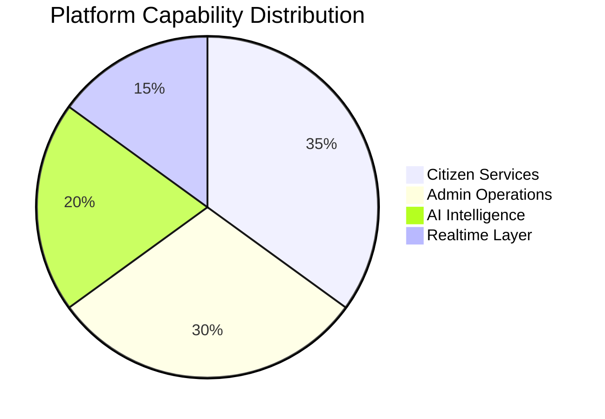
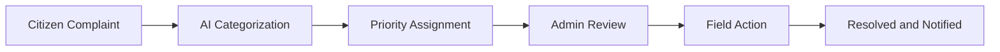
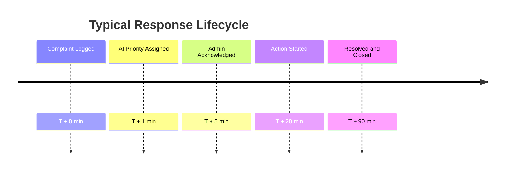
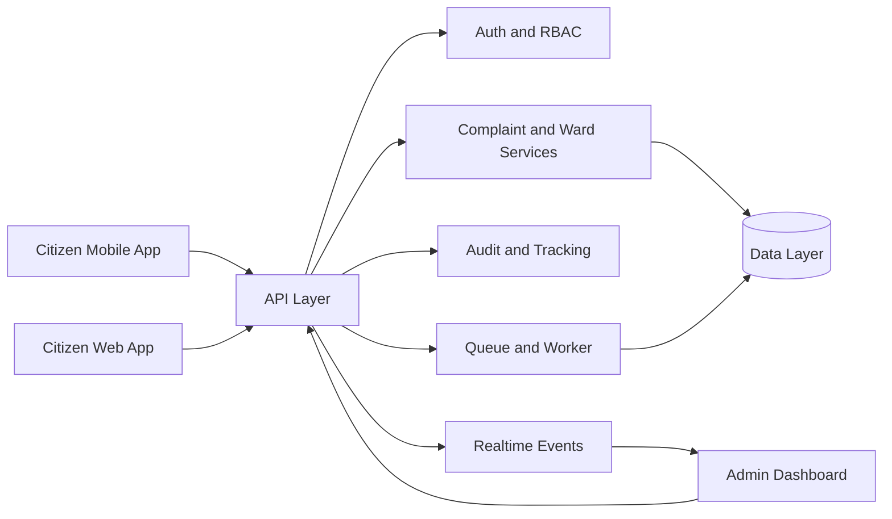

<div align="center">


<p>
  
  
  
</p>

</div>

---

## Executive Snapshot

India Innovates is a multi-platform civic-tech system designed to improve complaint response, safety operations, and governance visibility.

This version is fully transformed for clarity, visual quality, and judge-ready storytelling.

---

## Quick Navigation

<div align="center">

[Overview](#overview) • [KPI Highlights](#kpi-highlights) • [Impact Graphs](#impact-graphs) • [Architecture](#architecture) • [Platform Modules](#platform-modules) • [Quick Start](#quick-start) • [FAQ](#faq) • [Team Seekers](#team-seekers)

</div>

---

## Overview

### Why this project stands out

- Unified architecture across backend, web, and mobile
- AI-enabled decision support for civic workflows
- Realtime operational visibility for administrators
- Competition-grade product direction and execution

### Best in domain positioning

India Innovates by Team Seekers is positioned as a best-in-domain civic platform by combining AI intelligence, emergency readiness, and actionable realtime operations in one ecosystem.

<div align="center">


</div>

---

## KPI Highlights

<div align="center">


</div>

---

## Impact Graphs

<div align="center">


</div>

### 1. Capability Mix



### 2. Complaint-to-Resolution Journey



### 3. Operational Timeline (Illustrative)



---

## Architecture



### Monorepo surfaces

- backend: API routes, middleware, services, queue worker, socket events
- sankalp-ai: Next.js web app for dashboards and citizen interactions
- sankalp-ai app: Expo mobile app for citizen-first workflows

---

## Platform Modules

### Admin

- Incident and complaint operations panel
- Audit visibility and workflow controls
- Prioritized task handling with realtime status updates

### Citizen

- Fast complaint creation and lifecycle tracking
- Accessible mobile-first service flows
- Transparent status visibility and trust-oriented experience

### AI

- Complaint intelligence and classification support
- Priority recommendation signals
- Extensible AI integration points for advanced analytics

---

## Core Technology

| Layer | Stack |
|---|---|
| Backend | Node.js, TypeScript, Express, Socket.IO, Bull, JWT |
| Web | Next.js, React, Tailwind CSS, Framer Motion, Recharts |
| Mobile | Expo, React Native, Expo Router, React Query |
| Data | In-memory currently, PostgreSQL migration ready |
| AI | Google Generative AI integration points |

---

## Quick Start

### Install all dependencies

```bash
npm run install:all
```

### Run backend and web together

```bash
npm run dev
```

### Run services individually

```bash
npm run backend
npm run frontend
```

### Backend

```bash
cd backend
npm run dev
npm run build
npm run start
npm run seed
npm run migrate
```

### Web

```bash
cd sankalp-ai
npm run dev
npm run build
npm run start
npm run lint
```

### Mobile

```bash
cd "sankalp-ai app"
npm run start
npm run server:dev
npm run lint
```

---

## FAQ

### What makes this different from a standard complaint platform?

It combines AI support, realtime operations, and multi-surface delivery for both citizens and administrators.

### Is this only a demo concept?

No. The repository includes runnable service scripts, implemented route structures, and modular app surfaces.

### Can this scale for city-level deployments?

Yes. The architecture is modular and supports queue-driven processing and realtime event pipelines.

### Why is this competition-ready?

The project balances technical depth, operational clarity, and premium presentation suitable for judges and stakeholders.

---

## Team Seekers

<div align="center">


<p><strong>Built with ambition. Engineered with discipline. Delivered for impact.</strong></p>

</div>

---


<div align="center">


</div>

<div align="center"><strong>All rights reserved unless explicitly stated otherwise.</strong></div>
